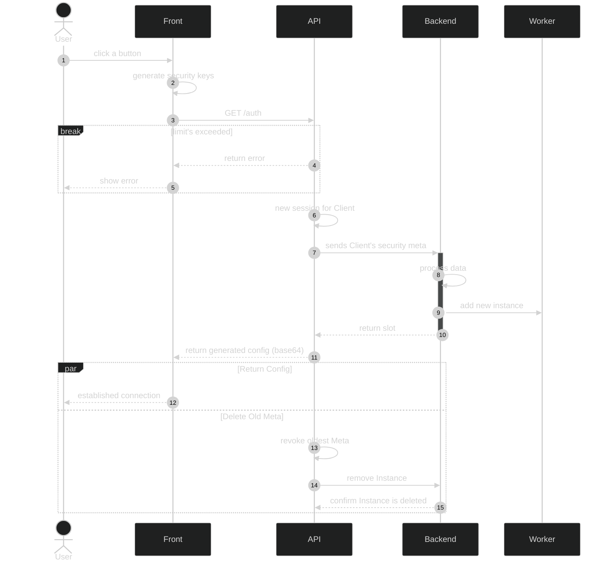

+++
title = "Markdown Test/Cheatsheet"
subtitle = "This is Markdown test and cheatsheet for Duckquill + Tufte"
tags = ["markdown", "customization", "tech"]
date = 2025-02-22
draft = false
author = "Uno Yakshi"

[extra]
toc = true
toc_sidebar = true
disclaimer = "This page is mostly for my own manual tests. It's public so others could use it, too."
+++

This is Markdown Test/Cheatsheet for [Duckquill](https://duckquill.daudix.one/) Zola theme and my buggy adaptaion of [Tufte-CSS](https://edwardtufte.github.io/tufte-css/).

# Typography Elements

This is a paragraph. 

**This text is bolded.** 

_This text is italic._ 

We can  also **_combine_** them. 

A highlighted inline code looks like `ThisIsMyCode()`.
You can check  how fenced code block works in the [Code Blocks](#code-blocks) section.

This text is a [hyperlink](#) or [http://www.example.com](http://www.example.com).

## Others

Markdown abbreviations:
*[HTML]: Hypertext Markup Language
*[CSS]: Cascading Style Sheets

HTML `<abbr>` tag:
the <abbr title="Hyper Text Markup Language">HTML</abbr> specification
is maintained by the <abbr title="World Wide Web Consortium">W3C</abbr>.

`<sub>` tag: CO<sub>2</sub>

With `^`: X^2^

`<sup>` tag: X<sup>n</sup> + Y<sup>n</sup> = Z<sup>n</sup>

With `~`: H~2~O

Keyboard: <kbd>Ctrl</kbd> + <kbd>Q</kbd>

Mark/highlight: TODO

___

## Headings H1 to H6

# H1 Heading

## H2 Heading

### H3 Heading

#### H4 Heading

##### H5 Heading

###### H6 Heading

___

# Markdown

## Blockquote

Quote with Markdown syntax:
> The roots of education are bitter, but the fruit is sweet.
> 
> Said Aristotle, probably.

Quote with Zola shortcode:


The determination to win is the better part of winning.



Many web sites use Cloudflare to filter access. The goal of preventing DDS attacks is not in itself bad, but Cloudflare does bad things to each legitimate visitor:

- It determine's the visitor's location based on per IP address. (Using a proxy can thwart this.) Tracking people is unjust.
- It acts as a man-in-the-middle in encrypted (HTTPS) communication between the visitor and the site: Cloudflare knows what page the visitor is looking at and sees any other communication as well. 

___

## List Items

1. First order list item
2. Second item

* Unordered list can use asterisks
- Or minuses
+ Or pluses

___

## Code Blocks


With `<pre>` tag:
<pre>
var s = "JavaScript syntax highlighting";
alert(s);
</pre>

In Duckquill, the Markdown code blocks (` ``` `) should indicate the used language AND have a copy button on the right.

```js
var s = "JavaScript syntax highlighting";
alert(s);
```

```js
setTimeout(function () { alert("JavaScript"); }, 1000);
```

```python, linenos
test_var = 'Python syntax highlighting'
print(test_var)

for idx, val in range(len(test_var)):
    print(f'{idx} :: {val}')  # Wrong highlighting!


def is_it_cool() -> bool:
    """
    Some method docstring...
    
    :return: Until it is perfect, False!
    """
    return False
```

```shell, linenos, linenostart=1, hl_lines=3-4 8-9, hide_lines=2 7
# This code block uses, in a nutSHELL (via comma), several extra settings:
echo '20'
- lineos
- linenostart=10
- hl_lines=3-4 8-9
- hide_lines=2 7
```


```scss, linenos, linenostart=10, hl_lines=3-4 8-9
pre mark {
  // If you want your highlights to take the full width
  display: block;
  color: currentcolor;
}
pre table td:nth-of-type(1) {
  // Select a colour matching your theme
  color: #6b6b6b;
  font-style: italic;
}
```

___


## Table

### Table 1: With Alignment
| Tables        | for           | Markdown  |
| ------------- |:-------------:| -----:|
| col 3 is      | right-aligned | ok? |
| col 2 is      | centered      |   Got it? |
| col 1 is | left-aligned      |    Alright!!! |

### Table 2: With Typography Elements
Another | table | here
--- | --- | ---
*I* | `am` | **row**
1 | two | III

___

## Horizontal Line

The HTML `<hr>` element is for creating a "thematic break" between paragraph-level elements. In markdown, you can create a `<hr>` with any of the following:

* `___`: three consecutive underscores
* `---`: three consecutive dashes
* `***`: three consecutive asterisks

renders to:

___

---

***

<br>


# Custom

## Sidenotes
Instead of footnotes, I've decided to focus more on the concept of _sidenotes_ from Edward Tufte.
I don't really want the whole scientific R-Markdown pacakge, but I find most web-sites lack such feature.

Sidenotes are basically footnotes but **right** near the text.
Let's check if inline sidenotes works.{{ sidenote(uid="inline", body="__Bold__ move!", inline=true) }}
If you see some __bold__ on the right, then it is!

Now let's check if a multi-line body will work!

Here starts our multi-line sidenote body...
It can be a list:
- one
- two
  - two and a half
WTF? Why doesn't it work inline?
 

Let's check if sidenotes work inline, w/o creating a new paragraph (`<p>...</p>`): 
This sidenote should be inline!
But can it be a code block?
```python
print('Apparently so!')
```

What about a quote?
> Yes!


Instead of using footnotes on "the bottom of the page" Tufte-CSS suggests show them on the right of the text.
Just like you'd probably do in your notebook.

## Margin Notes

### In-Line
This is a sentence with a **margin note** here. And it continues.

### Per-Line
This is a sentence with a

**margin note** here.

And it continues.

### Multi-Line
This is a sentence with a multi-line Markdown marginnote.
 
Should support:
- a list
- code block
```python
print('It does!')
```

It should be on the right, as always.

### The Usual Way
This is a sentence with a


**margin note** here.


And it continues.


## Footnotes / List
Placing the `footnote-definition` class (e.g., for `<div>`) will have the same Markdown syntax as footnotes.
If you have some text that you want to refer with a footnote, do as follows. This is an example for the footnote number one [^1].
Add more footnotes, with link. [^2] he

And the list goes here:

[^1]: Footnote number one.
[^2]: A footnote you can link to --- [click here!](#)
```markdown
[^2]: A footnote you can link to --- [click here!](#)
```


## Media

### [Invidious](https://invidious.io) 
<abbr title="Free (Libre) and Open Source Software">FOSS</abbr> YouTube front-end with no telemetry from Big Tech.
 Embedded Iframe

<iframe id='ivplayer' width='640' height='360' src='https://inv.nadeko.net/embed/43XaZEn2aLc?t=2864' style='border:none;'></iframe>

<br>

### Image


Image Source: [WonderfulEngineering.com](https://wonderfulengineering.com/)

{{ image(url="https://upload.wikimedia.org/wikipedia/commons/thumb/2/24/Male_mallard_duck_2.jpg/800px-Male_mallard_duck_2.jpg", full_bleed=true) }}

# Extra Features

## KaTeX
Display: $$f(x) = \int_{-\infty}^\infty\hat{f}(\xi)\,e^{2 \pi i \xi x}\,d\xi$$

Inline: $\relax f(x) = \int_{-\infty}^\infty\hat{f}(\xi)\,e^{2 \pi i \xi x}\,d\xi$


## GitHub Alerts
> [!NOTE]
> Useful information that users should know, even when skimming content.

> [!TIP]
> Helpful advice for doing things better or more easily.

> [!IMPORTANT]
> Key information users need to know to achieve their goal.

> [!WARNING]
> Urgent info that needs immediate user attention to avoid problems.

> [!CAUTION]
> Advises about risks or negative outcomes of certain actions.

### GitHub-flavoured Alerts

Note alert text



Tip alert text



Important alert text



Warning alert text



Caution alert text


## Mermaid Diagrams
Code block based MermaidJS:


Shortcode-based MermaidJS:

---
config:
  layout: elk
  look: handDrawn
  theme: dark
---
sequenceDiagram
    autonumber

    actor user as User
    participant client as Front
    participant api as API
    participant back as Backend
    participant service as Worker

    %% Request a new config...
    user ->> client: click a button

    client ->> client: generate security keys
    client  ->> api: GET /auth
    break limit's exceeded
        api -->> client: return error
        client -->> user: show error
    end
    api ->> api: new session for Client

    api ->>+ back: sends Client's security meta
    back ->> back: process data
    back ->> service: add new instance
    back -->>- api: return slot

    api -->> client: return generated config (base64)
    par Return Config
        client -->> user: established connection
    and Delete Old Meta
        api ->> api: revoke oldest Meta
        api ->> back: remove Instance
        back -->> api: confirm Instance is deleted
    end

