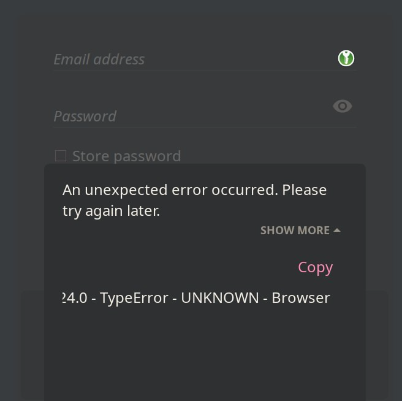

+++
title = "On E-mail Providers"
subtitle = "Why did I choose Posteo?"
tags = ["PSA", "email", "comparison"]
date = 2025-02-26
draft = true
author = "Uno Yakshi"

[extra]
toc = true
toc_sidebar = true
disclaimer = "Do not treat this page as a viable source in your own threat modeling."
+++

# TL&DR
I decided to use [Posteo](https://posteo.de/en/) as a email-provider as it:
- allows to setup OpenPGP and S/MIME
- does most of the hard work for me
- has a neat reputation in <abbr title="Privacy ― Security ― Anonymity">PSA</abbr> world
- costs 1 €/month (and accepts cash)
- somewhat cares about ecology

# Intro
I've spent quite some time {{ sidenote(uid="time-spent", body="Ca. a full-time week.", inline=true) }} to compare several options when 
it came to email.
I've also considered running my own instance. Probably [Mailcow](https://mailcow.email/) or [Stalwart](https://stalw.art/).

Unfortunately, I'm not going to describe all the comparisons here, not as of now at least.
However, I will gladly share my key takeaways and reasoning [for choosing Posteo].

# Reasons
If in 2025+ some people are still in doubt,
I'm but to provide a few reasons why you should choose an email provider <abbr title="if and only if">iff</abbr>:
- your infrastructural scale doesn't really scream for your own thing
- your threat model allows it 
  - and your tech savviness allows you can set up all the public-private-certificate shebang
- you are lazy and mortal

## Time
The first reason I even considered email service providers is time itself.
If I've spent a week just to compare 10+ services and tools, how much would it take to correctly setting it up?
Would there be no such services at all if it'd be so easy support one?
In case you are a single individual (or a small team/family), you are better to go with a provider.
I mean, most people already do it with Gmail, MS Outlook, Yahoo, Baidu, etc.
The only difference is, alas, that they don't care PSA.

## Complexity
Speaking of "easy", it's not. Neither it's simple. There are a number of aspects you need to consider.
For example:
- have a reliable hosting [in data-center] or take care of your own infrastructure with 99.999+% availability
- correctly setup all the policies:
<abbr title="Sender Policy Framework">SPF</abbr>, <abbr title="DomainKeys Identified Mail">DKIM</abbr>, <abbr title="Domain-based Message Authentication Reporting & Conformance">DMARC</abbr>
- correctly setup E2EE: [Open]PGP, <abbr title="Secure/Multipurpose Internet Mail Extension">S/MIME</abbr>, etc.
- spam filter
  - no, AI model reading all your emails is not a solution (not in my case)
- malware filter
  - ads (Facebook Pixel, Google Tag Manager, )
- backups!  
Remember the [3-2-1 rule](https://www.seagate.com/gb/en/blog/what-is-a-3-2-1-backup-strategy/):
- 3 data copies
- 2 types of storage/media
- 1 offsite location


# On Posteo
After careful and a bit stressful considerations I've decided to stay on Posteo

- it provides necessary level of privacy and anonymity [for me]
- it utilizes Open Source solutions, including OpenPGP
- it's 'all green' as in no real red flags + ecology-wise
- it's really cheap

## No Custom Domain?!
The first drawback I realized (just right after paying for it), there is no support for custom domain.
It was odd, even considering it's just 1 euro/month. A few questions came to my mind nearly in an instant.

1. Why would a commercial company refuse an extra ~~buck~~euro?
2. How will I look in the IT/business community with `<username>@posteo.de` near my commits?
3. How long will it take till I get my money back? Or should I even revoke my account?
4. Is it a lacking feature, or is it by-design? Why?
5. WHY the Force not?

Long story short, it is a hole.

## DMARC Policy is set to `None`?!
Apparently, it is not recommended to set DMARC for email providers.

# Services List
- ProtonMail ― a default choice if you don't really want to get into PSA too much.
  - supports PGP instead of OpenPGP
  - custom domains
  - E2EE email body and attachments ― doesn't encrypt Subject line
    - I guess they don't encrypt meta-data as well
- [Tuta](https://tuta.com/) (ex Tutanota) ― another namely Germany-based email provider
  - I couldn't Sign Up with my browser setup

- [CounterMail](https://countermail.com/) ― super-~~paranoid~~aware

They even store the encrypted data on CDs instead of HDDs.
(I love it!)
and kind of pricey (to me), but I don't have an invitation code.
They still have [a bunch of useful tool](https://webmail.countermail.com/tools/tools.html) in the open.
- Mailfence
- Startmail
